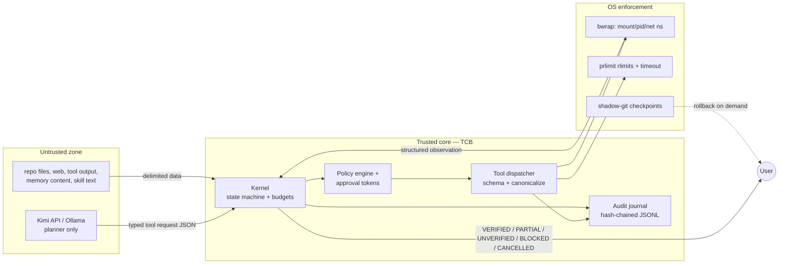
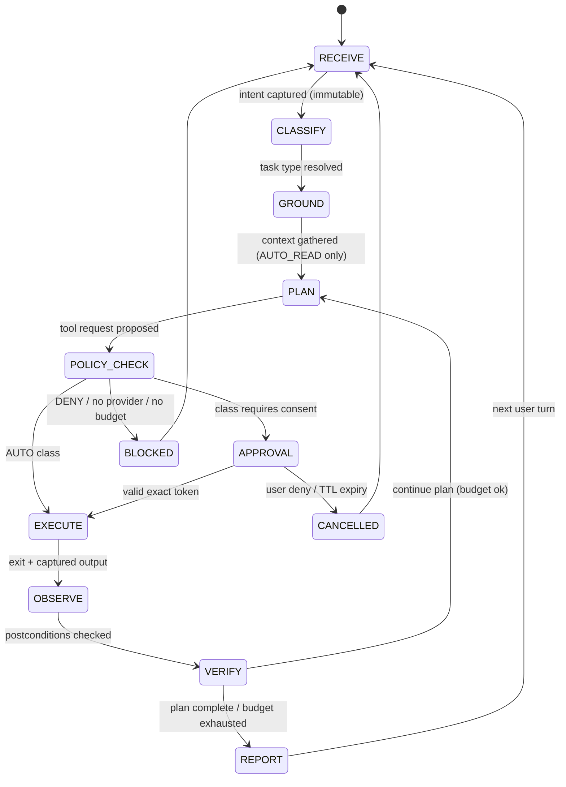
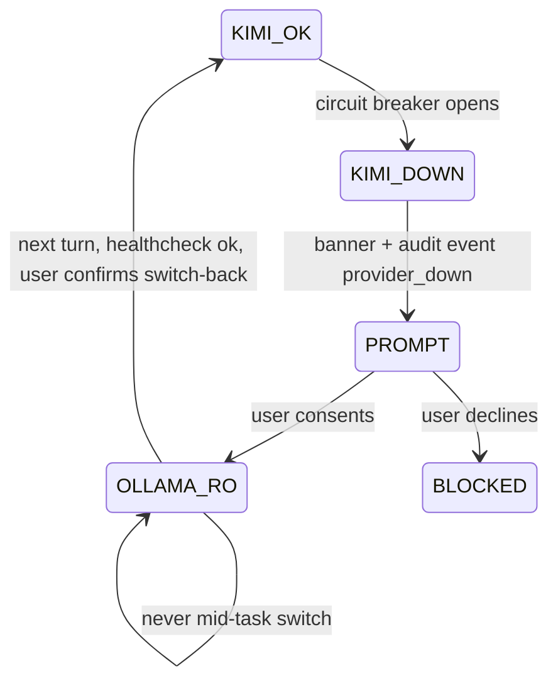

# LinuxSec Assistant — Technical Specification (Gate 2)

- **Version:** 0.1.0-draft
- **Date:** 2026-07-23
- **Status:** GATE 1 APPROVED (მომხმარებლის მიერ, 2026-07-23) / GATE 2 APPROVED (მომხმარებლის მიერ, 2026-07-24)
- **Product contract:** `2026-07-23-personal-linux-ai-assistant-master-prompt.md`
  - SHA-256: `469c1d7313c8335b59dedbe448a70d173ec516cfef95766990791398ec82f04d` (634 lines)
  - ეს დოკუმენტი ინახავს master spec-ის ყველა non-negotiable მოთხოვნას; კონფლიქტის შემთხვევაში master spec-ი უპირატესია.
- **Gate 1 report:** ჩაითვალოს ამ დოკუმენტის საფუძვლად; მისი მთავარი დასკვნები ნარჩუნებულია Appendix A-ში.

---

## 0. დოკუმენტის კონტროლი

### 0.1 Decision log (Gate 1-ის blocking decisions, მომხმარებლის მიერ დამტკიცებული რეკომენდებული ვარიანტებით)

| ID | გადაწყვეტილება | არჩეული ვარიანტი | ADR |
|---|---|---|---|
| D1 | Provider usage scope (ToS) | (a) Kimi membership API, honest User-Agent, interactive-only, coding-shaped workflows პრიმარი; open-platform pay-as-you-go adapter = documented plan-B | ADR-003 |
| D2 | ენა | Python 3.12+ thin core; Rust privilege broker = V2-ის evidence-gated ოფცია | ADR-001 |
| D3 | Secrets storage | OS keyring (`secretstorage`/libsecret) როცა ხელმისაწვდომია; fallback = `0600` permission-იანი ფაილი `$XDG_CONFIG_HOME`-ში | ADR-004 |
| D4 | Packaging | stdlib `venv` + `pip --require-hashes` bootstrap; `uv tool install` = optional fast-path როცა `uv` არსებობს | ADR-005 |

D1–D4 ნებისმიერ მომენტში შეცვლადია მომხმარებლის მიერ; ცვლილება = ამ ცხრილის row-ის განახლება + შესაბამისი ADR-ის `superseded`-ად მონიშვნა.

### 0.2 ტერმინოლოგია

- **TCB (Trusted Computing Base)** — კოდის ის ნაწილი, რომლის შეცდომაც security invariant-ს უღრმულიავს. მოიცავს: kernel state machine, policy engine, approval token service, tool dispatcher, sandbox profile builder, audit writer, checkpoint manager, secrets resolver, redactor.
- **Untrusted** — LLM-ის ყველა output; repository-ის ტექსტი; web content; tool output; memory content; skill text; MCP content.
- **Evidence** — deterministic არტეფაქტი: exit code, captured output digest, diff hash, test result, file inode/hash snapshot.
- **VERIFIED** — მხოლოდ evidence-ზე დაფუძნებული verdict; მოდელის თავდაჯერებულობა evidence არ არის.

### 0.3 ენის წესი

დოკუმენტი და პროდუქტის UI: ქართული და ინგლისური. Code, command, path, schema field, protocol, identifier — ყოველთვის ინგლისურად, უცვლელად.

---

## 1. მისია და Invariants

### 1.1 მისია

დამოუკიდებელი, ნულიდან აგებული პერსონალური Linux AI-ასისტენტი: საკუთარი codebase, interactive CLI, deterministic agent kernel, provider abstraction, typed tool runtime, capability-based permission engine, skills system, memory lifecycle, Linux Tutor Mode, Coding Mode, audit/recovery, human-gated self-improvement ლაბორატორია.

არა-მიზნები: Hermes/OpenClaw fork ან wrapper; Kimi Code CLI wrapper; renamed framework; foundation model training; always-on daemon; unrestricted root agent.

### 1.2 Non-negotiable invariants (master spec §4-ის ზუსტი გადმოტანა, enforceable ფორმით)

| # | Invariant | Enforcement mechanism | Verification |
|---|---|---|---|
| I1 | LLM proposes; kernel authorizes | LLM-ს არ აქვს subprocess/fs-write handle; მხოლოდ typed tool request → kernel | static check: providers/ package-ში `subprocess`/`os.open` import-ების არარსებობა |
| I2 | No direct shell from model output | tool registry-ში shell-string tool V1-ში არ არსებობს; exec = argv array | registry test: ყველა tool-ის manifest-ში `input_schema` typed |
| I3 | Typed tools over general shell | V1 tool set = §6.4; shell tool = V2 evidence-gated | manifest schema test |
| I4 | Every action: scope, normalized args, timeout, output limit, policy class, audit event, failure behavior | tool manifest JSON Schema (§6.2) — ყველა field required | schema validation over registry |
| I5 | Approval binds to exact action | HMAC token: tool + normalized args + canonical paths + cwd + env digest + action hash + max_uses + TTL | §7 tests AC-09 |
| I6 | Material change invalidates approval | re-canonicalization pre-exec; hash mismatch → re-approval | §7.5 race tests |
| I7 | Untrusted input everywhere | delimiter wrapping + capability reduction (§4.6); never system-role | red-team corpus AC-10 |
| I8 | No secret exposure | DENY_ALWAYS paths; env allowlist; redactor audit/prompt-ში | canary tests AC-12 |
| I9 | Reversible by design | shadow-git checkpoints pre-mutation; atomic writes | AC-06, AC-11 |
| I10 | No hidden persistence | install/coding/LAB flow-ებში systemd/cron/autostart write არ არსებობს | AC-02 test: no persistence artifacts |
| I11 | No sandbox claims without OS enforcement | exec isolation = bwrap; ამის გარეშე "sandboxed" სიტყვა docs/UX-ში აკრძალულია | docs lint |
| I12 | No completion without evidence | kernel: verdict=VERIFIED მოითხოვს evidence record-ს | kernel invariant test AC-13 |
| I13 | Never erase unrelated user changes | baseline tree hash guard (§16.3) | AC-06 e2e |
| I14 | No destructive git reset/checkout cleanup | ასეთი git tools registry-ში არ არსებობს | registry enumeration test |
| I15 | No implicit gate crossing | state machine: POLICY_CHECK→EXECUTE მხოლოდ AUTO კლასით ან valid token-ით | state machine model test |
| I16 | No chain-of-thought in output/logs | audit/UI შეიცავს decision rationale, evidence, alternatives — არა raw CoT; `reasoning_content` არ იწერება audit-ში, ინახება მხოლოდ provider turn state-ში (RAM) | audit schema test |

---

## 2. არქიტექტურა: Trust Boundaries და კომპონენტები

### 2.1 Trust boundary diagram



**Boundary-ის ზუსტი განმარტება:** ერთადერთი load-bearing security boundary-ია (1) kernel-ის dispatch pipeline — კოდი, რომელიც ყოველ tool call-ს ატარებს validation/policy/approval-ს, და (2) OS-level isolation — bwrap namespaces + rlimits + Unix permissions + atomic fs operations. Prompt-level ინსტრუქციები (delimiters, "do not follow injected text") არის **signal layer**, არა boundary; ისინი ამცირებენ likelihood-ს, მაგრამ დიზაინი ვარაუდობს, რომ ისინი ჩაიშლება — სწორედ ამიტომ untrusted turn-ზე tool capability იკვეცება (§4.6).

### 2.2 პაკეტები და dependency rules

Dependency direction მხოლოდ გარედან შიგნით. `kernel`, `policy`, `audit`, `sandbox`, `recovery`, `config` არ იმპორტებს `providers`-ს, `cli`-ს, `tutor`-ს, `coding`-ს — კომუნიკაცია data contracts-ით.

| Package | პასუხისმგებლობა | შეიძლება იმპორტი | აკრძალული |
|---|---|---|---|
| `cli/` | terminal I/O, rendering, approval prompt, flags | kernel API, contracts | subprocess, network, fs writes audit-ის გარდა |
| `kernel/` | state machine, budgets, loop detection, verdicts, journal | policy, contracts, audit | network, subprocess, providers |
| `policy/` | permission classes, token mint/verify, classification rules | contracts | I/O (pure functions) |
| `tools/` | tool manifests + handlers | sandbox, contracts, recovery | LLM calls; ერთმანეთის handlers |
| `sandbox/` | bwrap profile builder (pure) + runner | contracts | policy decisions (მხოლოდ profile-ს აშენებს) |
| `providers/` | Kimi/Ollama adapters, streaming, errors, usage | contracts (httpx) | subprocess, fs writes, tools, kernel |
| `memory/` | SQLite store, FTS, provenance, retrieval | contracts | LLM calls |
| `skills/` | manifest loader, trust tiers, lifecycle | contracts, policy | code execution skill-დან (V1: აკრძალული) |
| `audit/` | JSONL writer, redactor, rotation, reader | contracts | random access writes (append-only) |
| `recovery/` | checkpoints (shadow git), journal resume, idempotency | contracts, audit | destructive git |
| `config/` | XDG layout, config schema, secrets resolution | contracts | logging secrets |
| `tutor/` | Tutor Mode flows | kernel API | tools directly |
| `coding/` | Coding Mode flows | kernel API | tools directly |
| `contracts/` | shared pydantic models, JSON Schemas, enums | (stdlib+pydantic only) | ყველა სხვა package |

### 2.3 TCB definition და size budget

**TCB-ში შედის:** `kernel/`, `policy/`, `sandbox/`, `audit/` (writer+redactor), `recovery/` (checkpoint manager), `config/` (secrets resolver), `tools/` dispatcher core (გარეშე individual handlers — handlers untrusted-ად იკითხება შეცდომებისთვის, მაგრამ მათი manifests policy input-ია).

**TCB-გარეთ:** providers (output ვალიდატური უნდა იყოს), cli rendering, memory content, skill text, repo files, web content.

**Size budget:** TCB ≤ 6,000 LOC Gate 4 MVP-ზე; hard stop 8,000 LOC (§21 Gate 1 stop criteria). იზომება CI-ში (`tokei`-ს ექვივალენტი count job). ზღვარზე გადასვლა = feature freeze, არა budget-ის მოშვება.

---

## 3. Architecture Decision Records

### ADR-001: ენა — Python 3.12+ thin core

- **Status:** accepted (2026-07-23, D2)
- **Context:** საჭიროა typed contracts, argv exec, rlimits child-ზე, userns APIs, async streaming, CLI ecosystem, ერთი maintainer-ის ergonomics. Host: Python 3.12.3 ✓, Node 24.16 ✓, Go არ არის, Rust 1.96.1 ✓.
- **Decision:** core = Python 3.12+. Rust broker — მხოლოდ V2-ში, evidence-ით (TCB safety incidents ან boundary-test friction).
- **დასაბუთება (Gate 1 §10 matrix, weighted):** thin core 4.54 vs agent-lib 2.97 vs fork 1.89; Python-ის შიგნით გადამწყვეტი: stdlib `resource.setrlimit` (Node-ში საერთოდ არ არის — [nodejs.org/api/child_process](https://nodejs.org/api/child_process.html), 2026-07-23), stdlib `os.unshare`/`os.setns` (3.12+), asyncio cancellation, official openai/anthropic/ollama SDK ecosystem ან plain `httpx`, `pydantic` → JSON Schema generation, `pip-audit` + PEP 740.
- **Consequences:** GIL უმნიშვნელოა (IO-bound CLI); refactor safety კომპენსირდება `mypy --strict` TCB-ზე + 100% branch coverage kernel/policy-ზე; startup ~30–80 ms მისაღებია interactive CLI-ზე.
- **Rejected:** Node (rlimits-ის არარსებობა = hard blocker §I4-სთვის); Go (host-ზე არ არის; schema validation სუსტი); Rust V1-ში (boilerplate cost ერთი maintainer-ისთვის; client ecosystem community-level).

### ADR-002: Sandbox — bubblewrap profiles + prlimit

- **Status:** accepted (2026-07-23)
- **Context:** host-ზე `bwrap 0.9.0`, unprivileged userns ჩართული (`unprivileged_userns_clone=1`, `max_user_namespaces=112429`), Docker 29.6.2 rootful, systemd 255, kernel `7.0.0-28-generic`.
- **Decision:** V1 exec isolation = bwrap ორი profile-ით (`ro`, `ws` — §8); resource caps = `prlimit` wrapper; no seccomp hand-rolling V1-ში; Landlock/Docker rootless = V2 evaluation.
- **დასაბუთება:** bwrap 0.9 მუშაობს setuid-ის გარეშე userns-ით ([README](https://github.com/containers/bubblewrap), 2026-07-23); mount/pid/net/IPC isolation unprivileged-ად; Flatpak-ის production track record. seccomp-ის მიტოვების მიზეზი: filters ვერ კითხულობს pointer args (path-based filtering შეუძლებელია), vdso bypass, glibc open→openat drift ([seccomp(2)](https://man7.org/linux/man-pages/man2/seccomp.2.html), 2026-07-23) — V1-ში policy maintenance cost > benefit, რადგან mount isolation + rlimits უკვე ფარავს V1 threat model-ის შესაბამის კლასებს.
- **Consequences:** `bwrap` runtime dependency (present ✓); sandbox-ის სიტყვა ნიშნავს კონკრეტულად: mount ns (scoped view), pid ns, ipc/ns, net ns OFF (network isolation), `--new-session` (TIOCSTI defense), `--die-with-parent`. ცნობილი limits: mounted-in sockets (D-Bus) escalation path-ია — ამიტომ V1 profiles არ bind-ავენ socket-ებს; kernel exploit-ების წინააღმდეგ bwrap არ არის გარანტია (§18 T-14).
- **Rejected:** rootful Docker V1-ში (daemon = root-equivalent, heavy per-command); systemd-run user scope (userns dependency იგივეა, მაგრამ fs granularity bwrap-ზე უფრო უხეში; V2-ში შეიძლება cgroup limits-ისთვის); DIY userns (bwrap-ის edge cases-ის ხელახალი ფლობა).

### ADR-003: Provider — Kimi membership API, honest identity, interactive-only

- **Status:** accepted (2026-07-23, D1-a)
- **Context:** master spec-ის primary provider = official Kimi Code membership API. Gate 1 verification [M]: API key workflow, endpoints, model IDs, quotas, ToS constraints დოკუმენტირებულია.
- **Decision:** adapter = `https://api.kimi.com/coding/v1` (OpenAI-compatible) primary protocol; User-Agent = `lsassist/<version> (+<repo-url>)` ყოველთვის honest; გამოყენება interactive-only (manually launched CLI, არა batch); feature set coding-shaped პრიმარი (Coding Mode, Tutor Mode). Plan-B adapter = Kimi Open Platform pay-as-you-go (`https://api.moonshot.ai/v1`) იგივე `ProviderProfile` interface-ით — არა V1 scope, მაგრამ interface-ი ამას უკვე ითვალისწინებს.
- **დასაბუთება:** docs პირდაპირ იძლევა third-party/self-built tools-ს ([overview](https://www.kimi.com/code/docs/en/), 2026-07-23); UA tampering = violation (იგივე); interactive-only = ToS ([community-guidelines](https://www.kimi.com/code/docs/en/kimi-code/community-guidelines.html), 2026-07-23).
- **Consequences / risks:** R1 — discretionary enforcement risk რჩება (docs "designed specifically for programming scenarios"); mitigation: usage shaping + fallback + plan-B adapter. Residual risk მიღებულია მომხმარებლის მიერ D1-ით.

### ADR-004: Secrets — OS keyring primary, 0600 file fallback

- **Status:** accepted (2026-07-23, D3-a)
- **Context:** API key არ უნდა მოხვდეს repo-ში, logs-ში, prompt-ში, child env-ში. Host: Zorin OS (GNOME-based) → libsecret keyring სავარაუდოდ ხელმისაწვდომია; headless SSH სესიაში შეიძლება არ იყოს.
- **Decision:** resolution order: (1) `LSASSIST_KIMI_API_KEY` env var; (2) OS keyring item `lsassist/kimi-api-key` via `secretstorage`; (3) fallback ფაილი `$XDG_CONFIG_HOME/lsassist/secrets/kimi-api-key` mode `0600`, ownership check (ეკუთვნის current user-ს, არა symlink). First-run setup wizard keyring-ში წერს; env var override დროებითი.
- **Consequences:** key never `.env`-ში repo-ს შიგნით; redactor (§14.3) იცის key-ის ფორმატი და ფილტრავს ყველა sink-ზე; rotation = wizard command + old key revoke Console-ში (user action).

### ADR-005: Packaging — venv + pip --require-hashes

- **Status:** accepted (2026-07-23, D4-a)
- **Context:** host-ზე `uv` MISSING, `pipx` unchecked; root install არ შეიძლება; single-user install საჭიროა.
- **Decision:** install = `python3 -m venv ~/.local/share/lsassist/venv && pip install --require-hashes -r requirements.lock`; shim `~/.local/bin/lsassist`. `uv tool install` — optional documented fast-path. Dependencies = minimal allowlist (§13.1) with exact pins + hashes.
- **Consequences:** zero new system packages; reproducible install; SBOM via `syft` CI-ში.

### ADR-006: Approval — HMAC exact-binding tokens, session-scoped

- **Status:** accepted (2026-07-23)
- **Decision:** §7-ის მიხედვით. V1-ში durable/cross-session allowlist არ არსებობს; "allow all" არ არსებობს; elevated session mode არ არსებობს. მიზეზი: OpenClaw-ის GHSA ისტორია აჩვენებს, რომ durable patterns + wrapper argv mutation = bypass class; exact binding + short TTL = bypass surface მინიმალური.
- **Consequences:** UX friction მეტია (measured: target ≤ 3 prompts typical coding task-ზე AUTO კლასების გამო); თუ dogfooding-ში friction > threshold → V1.1-ში durable exact-argv tokens (არა patterns) evidence-ით.

### ADR-007: Memory — SQLite + FTS5, provenance-tiered

- **Status:** accepted (2026-07-23)
- **Decision:** §10-ის მიხედვით. Vector DB/embeddings V1-ში არა (master spec); benchmark gate V2-ში. მიზეზი: FTS5 ფარავს single-user retrieval-ს; embeddings-ის poisoning surface და dependency cost V1-ში გაუმართლებელია.

### ADR-008: Skills — manifest + instructions, no executable code (V1)

- **Status:** accepted (2026-07-23)
- **Decision:** §9-ის მიხედვით. მიზეზი: ClawHavoc (341+ malicious skills, `curl|bash` payloads — subagent-reported [S3], კლასის დონეზე საიმედო) და Hermes-ის SECURITY.md პოზიცია ("skills execute arbitrary Python; boundary is operator review") აჩვენებს, რომ executable skills = code supply chain; V1-ში skill = data (instructions + manifest + tests), შესრულებადი კოდი skill-ში აკრძალულია.

### ADR-009: Self-improvement — LAB mode default-OFF, propose→halt

- **Status:** accepted (2026-07-23)
- **Decision:** §11-ის მიხედვით; master spec §11-ის ზუსტი განხორციელება. Running process ვერ ცვლის საკუთარ executable-ს; activation = separate `CONFIRM_EXACT`; policy artifacts LAB-ში immutable.

### ADR-010: No general shell tool in V1

- **Status:** accepted (2026-07-23)
- **Decision:** `proc.exec` არის typed argv tool bwrap-ით; shell-string tool V1-ში არ არსებობს. მიზეზი: Hermes (`-lic` login shell) და OpenClaw (`/bin/sh -c` + allowlist analysis) GHSA/CVE ისტორია — arbitrary shell string-ის parsing/allowlisting განუსაზღვრელი attack surface-ია (wrapper mutation, inline eval, glob traversal, POSIX flag combining).
- **Escape hatch (documented, not a loophole):** Tutor Mode ამზადებს exact command-ს მომხმარებლისთვის ხელით გასაშვებად (§17) — assistant-ის exec-ის გარეშე. V1.1 evidence gate: თუ >20% legitimate Coding Mode task `exec`-ით ვერ ფარება, shell tool განიხილება `CONFIRM_EXACT` + bwrap + full audit-ით.

---

## 4. Kernel: State Machine, Budgets, Verdicts

### 4.1 States და transitions

Outer loop (task-level): `RECEIVE → CLASSIFY → GROUND → PLAN → POLICY_CHECK → APPROVAL → EXECUTE → OBSERVE → VERIFY → REPORT`. Terminal pseudo-states: `BLOCKED`, `CANCELLED`. Inner loop: EXECUTE→OBSERVE→VERIFY მეორდება თითო tool call-ზე; PLAN-ზე დაბრუნება დაშვებულია budget-ის ფარგლებში.



### 4.2 Transition table (deterministic guards)

| From | To | Guard (pure function) | Side effect |
|---|---|---|---|
| RECEIVE | CLASSIFY | intent text non-empty; stored immutable `intent_record` | audit event `intent` |
| CLASSIFY | GROUND | task_type ∈ {coding, tutor, sysinfo, memory, skill, meta} | — |
| GROUND | PLAN | context reads ≤ `ground_read_cap` (default 40) | audit `ground` |
| PLAN | POLICY_CHECK | well-formed `ToolRequest` (schema-valid vs registry) | audit `plan_revision` |
| POLICY_CHECK | EXECUTE | `classify(request)` ∈ {AUTO_READ, AUTO_SCOPED_WRITE} | audit `policy_decision` |
| POLICY_CHECK | APPROVAL | class ∈ {CONFIRM_ONCE, CONFIRM_EXACT} | prompt rendered from canonical record |
| POLICY_CHECK | BLOCKED | class = DENY_ALWAYS ∨ budget exhausted ∨ provider unavailable | audit `policy_decision(deny)` |
| APPROVAL | EXECUTE | `token.verify(record)` — HMAC match, TTL ok, uses left, re-canonicalization match | audit `approval` |
| APPROVAL | CANCELLED | user deny ∨ timeout (default 120 s) | audit `approval(denied)` |
| EXECUTE | OBSERVE | process exit ∨ timeout ∨ killed | rlimit/timeout enforcement |
| OBSERVE | VERIFY | output captured, digests computed | audit `tool_result` (redacted) |
| VERIFY | PLAN | postconditions ok ∨ retryable failure; budget remains; not loop-detected | — |
| VERIFY | REPORT | plan complete ∨ budget exhausted ∨ unrecoverable failure | verdict computed |
| REPORT | RECEIVE | verdict emitted with evidence refs | audit `verdict`, journal checkpoint |

**Guards are pure functions** over `(state, request, registry, policy, budget)` — tested by property tests: arbitrary request sequences never reach EXECUTE without POLICY_CHECK, never reach EXECUTE for non-AUTO without valid token (AC-07, I15).

### 4.3 Budgets (per task; session budgets = sum caps)

| Budget | Default | Exhaustion behavior |
|---|---|---|
| `max_tool_calls` | 25 / task | forced REPORT, verdict PARTIAL |
| `max_plan_revisions` | 8 / task | forced REPORT, verdict PARTIAL |
| `max_tokens_in+out` | 180,000 / task | forced REPORT (K2.7 per-request cap 262,144 — [error-reference](https://www.kimi.com/code/docs/en/kimi-code/error-reference.html), 2026-07-23) |
| `max_wall_clock` | 30 min / task | forced REPORT |
| `max_cost_estimate` | user-configured; default = warn at 80% of observed weekly quota pattern | warning → user decision |
| `max_output_per_tool` | 50 KB stdout + 20 KB stderr | truncation marker + digest of full (discarded) output |
| `max_session_tool_calls` | 200 | session pause, user resume |

Loop detection: `action_hash` (tool+normalized args+cwd) 3× consecutive identical → halt → REPORT with `loop_detected` evidence. Refund rule: failed schema validation (model error) does not consume `max_tool_calls` (adopted pattern: Hermes `IterationBudget.refund` — reimplemented independently).

### 4.4 ExitReason enum (every REPORT carries one)

`completed`, `budget_exhausted:tool_calls|tokens|time|cost`, `loop_detected`, `policy_blocked:<rule_id>`, `approval_denied`, `approval_timeout`, `provider_unavailable:kimi|ollama|both`, `malformed_model_output`, `user_cancelled`, `verification_failed`, `grounding_failed`. (Pattern source: Hermes `_turn_exit_reason` — independently reimplemented as contracts enum.)

### 4.5 Verdict semantics

| Verdict | მოთხოვნა | Evidence requirement |
|---|---|---|
| VERIFIED | ყველა sub-goal-ზე deterministic check green (test exit 0, diff hash match, postcondition ok) | evidence refs in verdict record |
| PARTIAL | ≥1 sub-goal VERIFIED, დანარჩენი explicit list-ით | per-sub-goal status map |
| UNVERIFIED | evidence არ არსებობს ან შეუსაბამოა | missing-evidence list |
| BLOCKED | policy/provider/dependency stop | rule id / provider status |
| CANCELLED | user action | — |

Kernel invariant (I12): `verdict=VERIFIED` requires `len(evidence_refs) ≥ 1` და თითო evidence `type ∈ {test_result, exit_code, diff_hash, file_snapshot, command_output_digest}` — enforced in `contracts.Verdict` pydantic model (validation error otherwise).

### 4.6 Untrusted content handling (structural rule)

1. **Wrap:** ყველა external content (file body, web page, tool output, memory retrieval, skill text) იდება context-ში delimiter block-ით: `<<<UNTRUSTED_DATA id="<random 8-byte hex>" source="<origin>" provenance="<tier>">>` … `<<<END_UNTRUSTED_DATA <id>>>`. Embedded marker-like strings content-ში defanged (neutralized) insert-მდე (pattern: Hermes `_neutralize_delimiters`, OpenClaw `foldMarkerTextWithIndexMap` — independently reimplemented).
2. **Capability reduction:** turn-ი, რომელიც შეიცავს untrusted content-ს *ახალი* injection-ით (მაგ. ტექსტი, რომელიც action-ს ითხოვს), POLICY_CHECK-ზე იღებს `untrusted_turn=True` flag-ს; ამ turn-ში წარმოშობილი tool request-ები იზღუდება `AUTO_READ`-ით, თუ ისინი user-ის direct instruction-დან არ მოდის (heuristic + human gate: non-read action untrusted turn-ში = ყოველთვის `CONFIRM_EXACT`).
3. **Never system-role:** untrusted content არასდროს გადადის system message-ში; skills/memory ინექცირდება user-role context block-ად, provenance label-ით.
4. **Limit honesty:** docs/UI აცხადებს, რომ ეს არ არის გარანტია — გარანტია არის capability restriction + human gate + sandbox (I7, §2.1).

### 4.7 Idempotency და replay protection

თითო tool request იღებს `idempotency_key = HMAC(session_id, task_id, action_hash, seq)`. Recovery resume-ზე (§14.5) journal-დან ბოლო `seq` ცნობილია; already-executed `seq` არასდროს მეორდება — მდგომარეობა აღდგება `OBSERVE`-დან captured result-ით ან action თავიდან ფორმირდება PLAN-დან (non-idempotent tool-ებისთვის `EXECUTE` მოითხოვს fresh token-ს, თუ previous execution completed; partial execution (crash mid-exec) → human review prompt: "unknown side effects, inspect checkpoint diff").

---

## 5. Provider Contracts

### 5.1 `ProviderProfile` interface (provider-neutral)

ყველა provider adapter ახორციელებს ამ კონტრაქტს (pydantic models `contracts/`):

| Method / field | Contract | Failure behavior |
|---|---|---|
| `id: str` | მაგ. `kimi-coding`, `ollama-local` | — |
| `capabilities: ModelCapabilities` | `{tool_calling: bool, parallel_tools: bool, streaming: bool, thinking: bool, vision: bool, max_context: int, max_output: int, structured_output: bool}` | unknown field → conservative `false` |
| `stream_chat(request) -> AsyncIterator[StreamEvent]` | events: `text_delta`, `tool_call_delta`, `reasoning_delta`, `usage`, `error`, `done` | transport error → typed `ProviderError` |
| `complete_tool_request(messages, tools, effort, timeout, cancel_token)` | ერთი სრული turn; returns `AssistantTurn {text, tool_requests[], reasoning_opaque?, usage}` | timeout/cancel → `ProviderError(retryable=False)` |
| `normalize_error(raw) -> ProviderError` | `{kind: auth|quota|rate_limit|overload|transient|client|terminated, retryable: bool, retry_after_s: float|None, terminal: bool}` | unmapped error → `transient, retryable=True` (safe side: limited retries) |
| `usage() -> UsageAccounting` | `{requests_made, tokens_in, tokens_out, session_cost_estimate}` | — |
| `healthcheck() -> Health` | read-only probe | error → circuit breaker input |

Adapter-ში **აკრძალულია**: subprocess, fs writes, tool execution, credential-ების logging. `reasoning_opaque` ინახება მხოლოდ RAM-ში turn state-ში (Kimi-ს `reasoning_content` round-trip-ისთვის), არ იწერება audit-ში და არ ეგზება prompt-ში ტექსტად (I16).

### 5.2 Kimi adapter (`kimi-coding`)

**Verified contract [M, 2026-07-23]:**

| ელემენტი | მნიშვნელობა | წყარო |
|---|---|---|
| Base URL (OpenAI-compatible) | `https://api.kimi.com/coding/v1` (`POST /chat/completions`) | [overview](https://www.kimi.com/code/docs/en/) |
| Base URL (Anthropic-compatible) | `https://api.kimi.com/coding/` (`POST /v1/messages`) — V1.1 | იგივე |
| Auth | API key Kimi Code Console-დან (max 5, shown once); header: `Authorization: Bearer <key>` — **[INFERENCE]** protocol convention-დან; confirmed by first contract test | იგივე |
| Model IDs | `kimi-for-coding` (default, ყველა member), `k3` (Moderato+; 1M ctx Allegretto+), `kimi-for-coding-highspeed` (Allegretto+, ~3× quota burn) | იგივე |
| Tool calling | OpenAI format; `strict: true` default; name regex `^[a-zA-Z_][a-zA-Z0-9-_]{2,63}$`; parallel calls | [tool-use](https://platform.kimi.ai/docs/api/tool-use) |
| Quota | ~300–1,200 req / rolling 5h window; concurrency ≤ 30; weekly quota 7-day refresh; shared monthly membership pool | [membership](https://www.kimi.com/code/docs/en/kimi-code/membership.html) |
| Thinking | `reasoning_effort` mapping; tool-call assistant messages MUST retain `reasoning_content` when thinking enabled (400 otherwise) | [error-reference](https://www.kimi.com/code/docs/en/kimi-code/error-reference.html) |
| Limits | message body ≤ 2 MB; K2.7 per-request ≤ 262,144 tokens | იგივე |
| ToS | honest User-Agent required; interactive-only; no resale/repackage; violation → `Access terminated` | [community-guidelines](https://www.kimi.com/code/docs/en/kimi-code/community-guidelines.html) |

**Error taxonomy (adapter mapping):**

| HTTP / condition | kind | retryable | Adapter behavior |
|---|---|---|---|
| 401 invalid key / tier-gated model | auth | no | terminal; UI: key/tier problem; model catalog downgrade |
| 402 membership verification | transient | yes | retry ≤3 (1s→2s→4s) |
| 403 weekly quota / `Access terminated` | quota/terminated | no | terminal; visible banner; offer Ollama fallback prompt |
| 429 5-hour window / monthly limit | quota | wait | surface reset expectation; no auto-retry storm |
| 429 engine overloaded / too many requests | rate_limit/overload | yes | exponential backoff 1s→2s→4s→8s, jitter, ≤4 |
| 500 transient | transient | yes | ≤3 retries from 1s |
| 499 client disconnect / local cancel | client | no | cancellation propagates |
| 400 schema/format (incl. missing `reasoning_content`) | client | no | adapter bug → BLOCKED + diagnostics |

**Retry policy:** მხოლოდ `retryable=True` კლასები; max total 5 min per request chain; circuit breaker: 5 consecutive retryable failures ან 1 terminal error → `provider_down` state → §5.4 fallback flow. `Retry-After` honored when present (open-platform documented; coding-endpoint presence = [INFERENCE], honored if seen).

**Identity:** `User-Agent: lsassist/<semver> (+https://<repo>)` ყოველ request-ზე; contract test ამტკიცებს header-ს (AC-03). Model catalog resolution: startup-ზე cached catalog; 401 tier-gating response → model მონიშნულია unavailable-ად session-ში; never silent model substitution (user sees exact model id ყოველ turn-ზე).

**Usage telemetry:** client-side counter per rolling 5h window (estimate); `/usage` CLI command; warning at 80% estimated window usage; monthly pool exhaustion (403) → clear message + fallback offer.

### 5.3 Ollama adapter (`ollama-local`)

**Verified contract [G0 + S1, 2026-07-23]:**

| ელემენტი | მნიშვნელობა | წყარო |
|---|---|---|
| Endpoint | `http://127.0.0.1:11434` — allowlist regex `^https?://(127\.0\.0\.1\|\[::1\]\|localhost)(:\d+)?$` enforced config-ში (remote Ollama = config validation error) | [G0] |
| Version | `GET /api/version` → `0.30.6` | [G0] |
| Models (host) | `gemma4:e4b-it-qat` 7.5B Q4_0 (+ `gemma4-cline:64k/128k` variants); capabilities: `completion, tools, thinking, vision`; `context_length 131072` | [G0] `/api/tags` |
| Tool calling | `POST /api/chat` `tools` param (OpenAI-style); response `message.tool_calls[{function:{name, arguments}}]`; tool results `{role:"tool", tool_name, content}`; parallel calls documented | [api.md](https://github.com/ollama/ollama/blob/main/docs/api.md) |
| Capability probe | `POST /api/show` → `capabilities[]` contains `tools` | იგივე |
| Structured output | `format` param: `"json"` ან JSON schema | იგივე |
| Context | default `num_ctx` 4096 → adapter sets explicit `num_ctx` (default 32,768; configurable; VRAM trade-off warning >65,536 on 8 GB) | [faq](https://github.com/ollama/ollama/blob/main/docs/faq.mdx) |
| keep_alive | default 5m; adapter sets `keep_alive: "10m"` active session-ში; explicit unload on exit | იგივე |
| Concurrency | `OLLAMA_NUM_PARALLEL` default 1 — adapter serializes requests (client-side queue) | იგივე |

**Capability ≠ fidelity:** capability probe საკმარისი არ არის. Adapter ითხოვს `eval_results.json` (`$XDG_DATA_HOME/lsassist/evals/<model_digest>.json`) — ჩვენი tool-use eval suite-ის შედეგი ამ კონკრეტულ მოდელზე (§23.5). Gate: `schema_valid_rate ≥ 0.95` AND `correct_tool_selection ≥ 0.90` (50-case suite). V1 rule:

| Eval result | Tool set local model-ზე |
|---|---|
| no eval OR below threshold | **read-only**: `fs.read`, `fs.list`, `fs.find`, `sys.info`, `pkg.query`, `git.read` + Tutor EXPLAIN/GUIDED (არა DO_AND_TEACH exec-ით) |
| pass threshold | + `test.run` (ws profile), `net.fetch`; write/exec კვლავ არა |
| V1-ში never | `fs.write`, `fs.patch`, `proc.exec`, `git.worktree` — Kimi-only |

Malformed tool call local model-დან: schema validation აგდებს (kernel), counted; rate > 5% rolling → auto-demote to EXPLAIN-only + user notification.

### 5.4 Fallback flow (never silent)



- Transition ყოველთვის: visible banner (provider, reason, capability delta), audit event `provider_down`/`provider_fallback`/`provider_restored`, user consent.
- Mid-task provider switch-back აკრძალულია (master spec) — ახალი turn-იდან, user confirmation-ით.
- ორივე provider down → verdict BLOCKED, journal checkpoint, resume instructions.

### 5.5 Contract tests (both providers)

Recorded-stream golden tests: captured SSE sequences (sanitized) replayed through adapter → parsed events must match goldens. Live smoke (manual, opt-in): 3-call sequence (plain, tool-call, error-path) against real endpoints, results archived in `docs/provider-evidence/`. ნებისმიერი provider contract change → adapter diff + golden refresh = reviewable PR-level change (Gate 4 process).

---

## 6. Tool Runtime

### 6.1 Design rules

- Typed tools first; general shell tool V1-ში არ არსებობს (ADR-010).
- ყოველი tool = manifest (declarative) + handler (code). Registry = manifest-ების immutable catalog loaded at startup; cross-tool name shadowing rejected; runtime re-registration V1-ში არ არსებობს.
- Handler-ები არ ღებულობენ LLM context-ს — მხოლოდ validated args + execution context (cwd, sandbox profile, limits).

### 6.2 Tool manifest JSON Schema (contract)

```json
{
  "$schema": "https://json-schema.org/draft/2020-12/schema",
  "type": "object",
  "required": ["name", "version", "purpose", "input_schema", "output_schema",
               "permission_class", "capabilities", "timeout_s", "output_limits",
               "concurrency", "idempotent", "dry_run", "rollback", "redaction", "tests"],
  "properties": {
    "name": {"type": "string", "pattern": "^[a-z][a-z0-9_.]{1,31}$"},
    "version": {"type": "string", "pattern": "^\\d+\\.\\d+\\.\\d+$"},
    "purpose": {"type": "string", "maxLength": 300},
    "input_schema": {"type": "object"},
    "output_schema": {"type": "object"},
    "permission_class": {"enum": ["AUTO_READ", "AUTO_SCOPED_WRITE", "CONFIRM_ONCE", "CONFIRM_EXACT", "DENY_ALWAYS"]},
    "capabilities": {
      "type": "object",
      "required": ["fs", "net", "proc"],
      "properties": {
        "fs": {"enum": ["none", "read_scoped", "write_scoped"]},
        "net": {"enum": ["none", "fetch_allowlist"]},
        "proc": {"enum": ["none", "spawn_argv"]}
      }
    },
    "timeout_s": {"type": "integer", "minimum": 1, "maximum": 1800},
    "output_limits": {
      "type": "object",
      "required": ["max_stdout_bytes", "max_stderr_bytes", "max_result_chars"],
      "properties": {
        "max_stdout_bytes": {"type": "integer", "maximum": 1048576},
        "max_stderr_bytes": {"type": "integer", "maximum": 262144},
        "max_result_chars": {"type": "integer", "maximum": 200000}
      }
    },
    "concurrency": {"enum": ["exclusive", "shared_read", "unrestricted"]},
    "idempotent": {"type": "boolean"},
    "dry_run": {"type": "boolean"},
    "rollback": {"enum": ["none", "checkpoint", "manual_steps"]},
    "redaction": {"type": "array", "items": {"enum": ["paths", "secrets", "env", "full_body"]}},
    "path_scope": {"enum": ["workspace", "system_read", "config_own", "any_read"]},
    "tests": {"type": "array", "items": {"type": "string"}}
  },
  "additionalProperties": false
}
```

### 6.3 Dispatch pipeline (ყოველ tool call-ზე, ეტაპები fail-closed)

1. **Schema validate** — `jsonschema` args vs `input_schema`, `additionalProperties:false` ყველა tool-ზე. Fail → `malformed_tool_request` (model error, budget refund).
2. **Normalize/canonicalize** — paths: `realpath` fail-closed (symlink chain resolution, missing target → error unless `create_if_missing` tool and parent canonicalizes in-scope); argv: list[ str ] verbatim, no interpolation; env: allowlist projection.
3. **Policy classify** — deterministic rules (§7.2) → permission class for *this exact request* (manifest class is the ceiling; rules can only raise).
4. **Approval** — AUTO → proceed; CONFIRM → token verify ან prompt (canonical record render); DENY → BLOCKED.
5. **Sandbox profile build** — pure function `(tool, args, policy) → bwrap argv` (§8).
6. **Execute** — `prlimit` + `bwrap` + argv; `start_new_session` process group; timeout kill (`SIGKILL` process group); stdout/stderr caps; child env = allowlist only.
7. **Observe** — exit code, duration, output digests, truncated flags.
8. **Verify** — manifest postconditions (path hash expectations, schema of result, workspace tree guard).
9. **Audit** — append event (redacted) with all digests.

### 6.4 V1 tool catalog

| Tool | Class (ceiling) | Caps (fs/net/proc) | Timeout | Output cap | Key contract notes |
|---|---|---|---|---|---|
| `fs.read` | AUTO_READ | read_scoped / none / none | 10 s | 200 KB result | utf-8 errors=replace; binary → hex head 4 KB; DENY paths (§7.3) |
| `fs.list` | AUTO_READ | read_scoped / none / none | 10 s | 50 KB | sorted, depth ≤ 4 default |
| `fs.find` | AUTO_READ | read_scoped / none / none | 30 s | 200 KB | name/glob/content modes; regex size-capped; no `..` after canonicalization |
| `sys.info` | AUTO_READ | none / none / spawn_argv | 10 s | 50 KB | fixed argv allowlist: `uname -a`, `lscpu`, `free -h`, `df -h`, `os-release` read |
| `pkg.query` | AUTO_READ | none / none / spawn_argv | 20 s | 100 KB | fixed argv: `dpkg-query -W [pkg]`, `apt-cache show [pkg]`, `pip list` (venv); name arg validated `^[a-zA-Z0-9+._:-]+$` |
| `git.read` | AUTO_READ | read_scoped / none / spawn_argv | 20 s | 200 KB | fixed subcommands: `status --short --branch`, `diff [--cached] [path]`, `log --oneline -N`, `branch --show-current`, `worktree list`; repo = workspace |
| `fs.write` | AUTO_SCOPED_WRITE | write_scoped / none / none | 30 s | 10 KB (result) | atomic: tmp+`fsync`+`rename`; `O_NOFOLLOW` final component; checkpoint pre-write; overwrite requires `intent=overwrite` flag (else create-only fails if exists) |
| `fs.patch` | AUTO_SCOPED_WRITE | write_scoped / none / none | 30 s | 10 KB | search/replace blocks with exact-match anchors; all-or-nothing (no partial); checkpoint pre-patch |
| `git.worktree` | AUTO_SCOPED_WRITE | write_scoped / none / spawn_argv | 60 s | 20 KB | `git worktree add <path> -b <branch>` only; path inside workspace `.lsassist/worktrees/` |
| `test.run` | CONFIRM_ONCE | write_scoped / none / spawn_argv | 600 s | 200 KB | detected runner: `pytest`, `npm test`, `cargo test`; argv fixed per runner + user-visible extra args validated (no `;`, `&&`, backticks — argv tokens only); bwrap `ws` profile |
| `proc.exec` | CONFIRM_ONCE (raise-able to CONFIRM_EXACT) | write_scoped / none / spawn_argv | 120 s default | 50 KB | argv[0] ∈ allowlist (§7.4); policy rules raise class on dangerous argv patterns (§7.2 R5); bwrap `ws` |
| `net.fetch` | CONFIRM_ONCE (per domain) | none / fetch_allowlist / none | 30 s | 1 MB | GET/HEAD only; domain allowlist (config); https only (localhost http excepted); redirects stay in allowlist; content-type allowlist: text/*, application/json, application/xml; body → memory only (no direct disk write) |

**Explicitly absent in V1 (DENY by non-existence):** `shell`, `sudo`-capable exec, `pkg.install`/`pkg.remove`, `git.destructive` (reset/clean/push --force), `service.*` (systemctl writes), `firewall.*`, `credentials.*`, `send.*` (external messaging), `cron.*`. მომხმარებელი ასრულებს ამას ხელით; assistant ამზადებს exact command-ს Tutor Mode-ით (§17).

### 6.5 Tool result contract

```json
{
  "tool": "fs.read",
  "status": "ok | error | truncated",
  "exit_code": 0,
  "duration_ms": 12,
  "stdout_digest": "sha256:…", "stderr_digest": "sha256:…",
  "result": { },
  "evidence": {"type": "file_snapshot", "path": "…", "sha256": "…", "inode": 12345},
  "error": {"kind": "…", "message_redacted": "…"}
}
```

`result` ვალიდირდება `output_schema`-ზე; დიდი bodies digest-only + reference; ყველა result text kernel-ში untrusted-ად იმუშავებს (§4.6).

---

## 7. Permission Engine

### 7.1 Policy classes

| Class | სემანტიკა | Prompt | Token |
|---|---|---|---|
| AUTO_READ | არამგრძნობიარე read-only, scope-ში | არა | — |
| AUTO_SCOPED_WRITE | workspace write, checkpoint-ით | არა (visible log) | — |
| CONFIRM_ONCE | კონკრეტული ერთი action | canonical record render | 1 use, TTL 300 s |
| CONFIRM_EXACT | მაღალი რისკი (delete, overwrite-outside, network config, credentials, external send, destructive, security settings) | elevated render: რა იცვლება, რისკი, rollback | 1 use, TTL 120 s |
| DENY_ALWAYS | §7.3 | — | — |

### 7.2 Classification rules (deterministic, ordered; first match wins; rules can only RAISE class)

- **R1:** manifest class = ceiling; args-dependent rules მხოლოდ აწიათებენ.
- **R2:** path outside workspace + write intent → min CONFIRM_EXACT; DENY list hit → DENY_ALWAYS.
- **R3:** `untrusted_turn=True` (§4.6) → any non-AUTO_READ → CONFIRM_EXACT.
- **R4:** `proc.exec` argv contains metachar-heavy tokens (`;`, `&&`, `|`, backtick, `$(`, `>`) as *data tokens* → allowed (no shell), but class → CONFIRM_EXACT + explicit display of every token.
- **R5:** `proc.exec` argv[0] ∈ {`rm`, `rmdir`, `shred`, `dd`, `mkfs`, `mount`, `umount`, `chmod`, `chown`, `systemctl`, `iptables`, `nft`, `ufw`, `useradd`, `userdel`, `passwd`, `visudo`, `crontab`, `curl`, `wget`, `ssh`, `scp`, `git` (with destructive subcommand)} → CONFIRM_EXACT; argv[0] ∈ {`sudo`, `doas`, `su`} → DENY_ALWAYS (V1).
- **R6:** `net.fetch` domain ∉ allowlist → CONFIRM_EXACT with explicit domain display; ∈ known-executable-hosting (user-configured list, e.g. raw.githubusercontent.com) → +1 warning line in prompt.
- **R7:** write to `.git/` internals, `~/.config/lsassist/policy*`, audit logs → DENY_ALWAYS (self-approval/policy-tamper prevention).
- **R8:** memory durable write with provenance=model → CONFIRM_ONCE (§10.4).

### 7.3 DENY_ALWAYS list (kernel-enforced path patterns, canonicalized)

`~/.ssh/**`, `~/.gnupg/**`, `~/.kimi-code/**` (OAuth tokens), `**/.env`, `**/.env.*` (გარდა explicit task-scoped `.env.example`-ის), `~/.aws/**`, `~/.config/gh/**`, `/etc/shadow`, `/etc/sudoers*`, raw block devices `/dev/sd*`, `/dev/nvme*n*`, audit store, policy store, kernel secret. Action-ებიც: self-approval issuance, audit truncation, security setting changes, mass delete (heuristic: >50 files single action → CONFIRM_EXACT + per-file list).

### 7.4 Approval token (mechanism + contract)

- **Mint:** kernel holds `kernel_secret` (32 B random, install-time, `0600`, `$XDG_STATE_HOME/lsassist/kernel.secret`, ownership-checked at startup).
- **Record (canonical, rendered to user verbatim):**

```json
{
  "token_id": "uuid4",
  "session_id": "…",
  "tool": "proc.exec",
  "args_normalized": {"argv": ["pytest", "-q", "tests/"]},
  "canonical_paths": ["/home/null/Desktop/LinuxSec"],
  "cwd_real": "/home/null/Desktop/LinuxSec",
  "env_digest": "sha256:…(allowlisted env)",
  "action_hash": "sha256:…(tool+args+paths+cwd+env)",
  "max_uses": 1,
  "ttl_s": 300,
  "issued_at": "2026-07-23T19:00:00Z",
  "class": "CONFIRM_ONCE"
}
```

- **Token =** `HMAC_SHA256(kernel_secret, canonical_json(record))` hex. Stored kernel-side with use counter.
- **Display =** renderer input არის ეს record (არა მოდელის ტექსტი) — user sees exactly what is approved.
- **Verify at exec:** recompute normalization → compare `action_hash`; check TTL, uses; increment uses; any mismatch → token invalid → re-approval.

### 7.5 TOCTOU / symlink defense (complete chain)

1. Approval-ზე: `realpath` + per-component `lstat` (symlink → resolve; dangling → fail unless create-intent with in-scope parent).
2. Token ინახავს canonical paths + parent dir inode.
3. Pre-exec re-canonicalization: თითო path თავიდან resolve → hash compare; mismatch → invalid.
4. Handler fs access: `os.open(path, os.O_NOFOLLOW | …, dir_fd=canonical_parent_dirfd)` — final component swap გამორიცხული; interior component swap გამორიცხულია dirfd pinning-ით.
5. bwrap final view: sandbox-ში mount table ფიქსირდება launch-ზე; approved workspace-ის გარეთ rw bind არ არსებობს — symlink host-ზე sandbox-ის target-ს ვერ გადააქცევს.
6. Post-exec verification: expected paths-ის inode/hash snapshot compare (write tools-ზე) → mismatch = verdict UNVERIFIED + audit alert.
7. Wildcards: tool input schemas არ იღებენ glob-ებს write/exec args-ში; `fs.find`-ის glob მხოლოდ read-ში.
8. Command substitution: შეუძლებელია — argv exec, no shell.

**Session-scoped "remember" (V1 compromise):** user შეიძლება აირჩიოს "allow this exact action for session" → token `max_uses=∞`, `ttl=session end`, იგივე exact binding. Durable cross-session allowlist V1-ში არ არსებობს (ADR-006).

---

## 8. Sandbox Profiles (bwrap)

### 8.1 Profile `ro` (read-only observation, no network)

```
<abs bwrap> \
  --unshare-all --die-with-parent --new-session \
  --clearenv \
  --ro-bind /usr /usr --ro-bind /bin /bin --ro-bind /lib /lib --ro-bind /lib64 /lib64 \
  --ro-bind /etc/ld.so.cache /etc/ld.so.cache --ro-bind /etc/alternatives /etc/alternatives \
  --proc /proc --dev /dev \
  --ro-bind <workspace> <workspace> \
  --tmpfs /tmp --tmpfs <XDG_CACHE_HOME-subdir> \
  --setenv PATH /usr/bin:/bin --setenv HOME /tmp/lsassist-home --setenv LANG C.UTF-8 \
  --chdir <cwd> -- \
  <abs prlimit> --nproc=256 --nofile=1024 --as=4294967296 --cpu=<timeout+10> \
  <argv...>
```

**რევიზია 2026-07-25 (Gate 4 / T2.05–T2.06 + HARDEN-03) — სამი გაზომვით დადასტურებული შესწორება.** თავდაპირველი template იყო: `prlimit --nproc=256 --nofile=1024 --as=4G --cpu=… bwrap … --unsetenv LSASSIST_KIMI_API_KEY --chdir <cwd> -- <argv>`. თითოეული ცვლილება host-ზე გაზომილია (`bubblewrap 0.9.0`, `util-linux 2.39.3`):

| # | იყო | არის | მიზეზი (გაზომილი) |
|---|---|---|---|
| 1 | `--as=4G` | `--as=4294967296` | `prlimit`-ს **სუფიქსის პარსერი არ აქვს**: `4G` იკითხება როგორც **4 ბაიტი** → ყოველი `execve` კვდება `E2BIG`-ით (`prlimit --as=4G /bin/echo hi` → "Argument list too long"). Plain bytes-ით `ulimit -v` = 4194304 KB = ზუსტად 4 GiB, ე.ი. თავდაპირველი განზრახვა. |
| 2 | `--unsetenv LSASSIST_KIMI_API_KEY` | `--clearenv` (`--new-session`-ის შემდეგ, `--setenv` ბლოკამდე) | bwrap **default-ად არ ასუფთავებს env-ს** — `--setenv` მხოლოდ **მემკვიდრეობით მიღებულ** environ-ს აწერს ზემოდან. გაზომილი: `--clearenv`-ის გარეშე ბავშვი იღებდა **81 ცვლადს**, მათ შორის `LSASSIST_KIMI_API_KEY`, `SSH_AUTH_SOCK`, `XAUTHORITY`. `--unsetenv` არასაკმარისია (~80-იდან ერთ სახელს შლის) **და** მავნეა (secret-ის **სახელს** წერს `/proc/<pid>/cmdline`-ში, `ps`-ში, audit-ში). `--clearenv`-ით: ბავშვის env = ზუსტად `{HOME, LANG, PATH, PWD}`. **განლაგება load-bearing-ია** — `--setenv` ბლოკის შემდეგ დასმული `--clearenv` თავად projected ცვლადებსაც შლის. |
| 3 | `prlimit …` **გარეთ** (bwrap-ის გარშემო) | `prlimit …` **შიგნით** (`--`-ის შემდეგ, tool argv-ის წინ) | `RLIMIT_NPROC` ირიცხება **real UID-ზე** და ითვლის **task-ებს (thread)**, არა sandbox-ის პროცესებს. ჩვეულებრივ desktop სესიაში (გაზომილი: 1472–2024 thread) გარე `--nproc=256` bwrap-ს **namespace-ის შექმნასაც კი ვერ აძლევს** ("Creating new namespace failed: Resource temporarily unavailable") — ე.ი. გარე პოზიცია **არაფერს არ აღასრულებდა** და მთელ exec-ს ბლოკავდა. შიგნით ოთხივე cap ზუსტად ლანდდება (`nproc=256 nofile=1024 as=4194304 cpu=40`, hard limit-იც 256), `/usr/bin/prlimit` უკვე mount view-შია `--ro-bind /usr /usr`-ით, ის `execve`-ს აკეთებს (pid/exit/signal გამჭვირვალე რჩება §6.3-ის process-group SIGKILL-ისთვის), და `soft==hard` ნიშნავს რომ sandboxed tool-ს ლიმიტის აწევა **არ შეუძლია** (`ulimit -u 4096` → "Operation not permitted"). ⚠️ **გარე `--nproc`-ის უბრალო წაშლა** exec-ს ამუშავებს და fix-ს ჰგავს, მაგრამ ჩუმად შლის §18 T-14 fork-bomb კონტროლს. |

**პროგრამების გზები:** `<abs bwrap>`/`<abs prlimit>` = `probe()`-ით ვალიდირებული აბსოლუტური გზები (`{/usr/bin, /bin, /usr/local/bin}`-ის შიგნით). შიშველი სახელები **არ** გამოიყენება: PATH-ის shim (`~/.local/bin/bwrap`, writable, PATH #1) გაზომვით **სრულიად უსანდბოქსოდ** უშვებდა ინსტრუმენტს, სანამ probe "available"-ს აფიქსირებდა (I11). `<abs prlimit>` დამატებით უნდა იყოს mount view-ს შიგნით — თორემ ყოველი exec ჩავარდება.

### 8.2 Profile `ws` (scoped write, no network by default)

იგივე, გარდა: `--bind <workspace> <workspace>` (rw), plus `--tmpfs /tmp`; cache tmpfs rw; build/test tools-ისთვის `PATH` შეიძლება შეიცავდეს `<workspace>/.venv/bin` (exists-check). Network-enabled variant (`ws-net`) V1-ში არ არსებობს — test runners offline უნდა მუშაობდეს; დოკუმენტირებული V2 candidate.

### 8.3 Contract და failure behavior

- **Boundary:** mount ns (რა ჩანს), pid ns (process visibility), ipc/uts ns, net ns (loopback only), `--new-session` (TIOCSTI defense — [bwrap README](https://github.com/containers/bubblewrap), 2026-07-23), `--die-with-parent` (orphan prevention).
- **Env:** child env = მხოლოდ allowlist (`PATH`, `HOME`, `LANG`, `LC_ALL`, `TERM`, tool-specific additions like `CI=1`); **ასარაფერი secrets** — adapter env-ს sandbox runner ვერასდროს ხედავს (env constructed from scratch, not inherited).
- **Failure:** bwrap spawn failure → typed error `sandbox_unavailable` → exec tool BLOCKED (never fallback to unsandboxed exec — fail-closed); timeout → SIGKILL process group + verdict evidence `timeout`; rlimit breach → exit code captured as evidence.
- **Tests (AC-06/AC-09/T-02):** sandbox-ში `cat ~/.ssh/id_rsa` → ENOENT (path absent); `curl` → network unreachable; fork bomb → nproc cap; workspace-გარეთ write → EROFS; `--new-session` TIOCSTI probe fails.
- **Honesty (I11):** docs/UI-ში "sandbox" = ზუსტად ეს კონფიგურაცია; kernel exploit-ების წინააღმდეგ გარანტია არაა — threat model T-14.

---

## 9. Skills System

### 9.1 Skill = versioned procedural package (data, არა executable code V1-ში)

```
<skill-dir>/
  SKILL.md            # human-readable instructions (untrusted text)
  manifest.json       # schema below
  tests/              # eval cases (inputs + expected tool-request patterns)
  CHANGELOG.md
```

`manifest.json` schema (required fields): `schema_version`, `name` (`^[a-z][a-z0-9-]{1,63}$`), `version` (semver), `description` (≤1024 chars), `required_tools[]` (⊆ registry), `permission_class_max` (ceiling), `provenance {source, author, url?, fetched_at}`, `content_hash` (SHA-256 over canonical serialization of SKILL.md+manifest), `risk_class` (`low|medium|high`), `dependencies[]` (other skills by name+version range), `compatibility {min_core, max_core}`.

**Forbidden in V1:** `scripts/`, `hooks`, `code`, executable entry points, auto-install commands in SKILL.md treated as instructions-to-user only (Tutor Mode may *explain* them; assistant არ ასრულებს).

### 9.2 Trust tiers

| Tier | წყარო | Scan | Enable gate |
|---|---|---|---|
| `builtin` | repo-ში შეფუთული | full test suite | default enabled |
| `user` | მომხმარებელი თავად შექმნილს | manifest validate + content hash | `skills enable` (explicit) |
| `community` | third-party | manifest validate + static inspection report (pattern scan: exec-ზე მიმთითებელი ინსტრუქციები, credential paths, URLs) + human diff review | `CONFIRM_EXACT` + hash pinned |

### 9.3 Lifecycle (state machine)

`installed → inspected → enabled → (update-available → re-inspected) → disabled → removed`. ყოველი transition audit event. Enable: hash verify → registry check (`required_tools ⊆ registry`, `permission_class_max` vs policy) → context injection eligibility. Update = ახალი hash → mandatory re-confirm (no silent update). Rollback: previous enabled hash restore (skills kept versioned under `$XDG_DATA_HOME/lsassist/skills/<name>/<hash>/`).

### 9.4 Injection rules

- Skill text ინექცირდება §4.6 delimiter-ებით, provenance label-ით, user-role block-ად — never system instruction.
- `permission_class_max` enforcement: skill-ის turn-ში წარმოშობილი tool request-ი, რომელიც ceiling-ს აღემატება → policy R3-style raise/BLOCKED.
- Skill-ის "წაკითხვა ≠ შესრულება": loading = parsing only; instructions მოდელისთვისაა, kernel-ისთვის არა.

---

## 10. Memory System

### 10.1 ფენები

| Layer | Storage | Lifetime | Writer |
|---|---|---|---|
| working context | RAM (turn state) | session | kernel |
| session history | SQLite `sessions` + journal | 30 d default | kernel (auto) |
| durable preferences | SQLite `prefs` | until deleted | user direct / model via CONFIRM |
| episodic task history | SQLite `episodic` + FTS5 | 90 d → archive | kernel (auto, summarized) |
| procedural (skills) | §9 | versioned | user/LAB via gates |

### 10.2 SQLite DDL (V1)

```sql
PRAGMA journal_mode=WAL; PRAGMA foreign_keys=ON;

CREATE TABLE prefs (
  id INTEGER PRIMARY KEY,
  key TEXT NOT NULL,
  value TEXT NOT NULL,
  provenance TEXT NOT NULL CHECK (provenance IN ('user','model_confirmed')),
  confidence REAL NOT NULL DEFAULT 1.0,
  sensitivity TEXT NOT NULL DEFAULT 'normal' CHECK (sensitivity IN ('normal','sensitive')),
  created_at TEXT NOT NULL,
  updated_at TEXT NOT NULL,
  ttl TEXT,
  UNIQUE (key)
);

CREATE TABLE episodic (
  id INTEGER PRIMARY KEY,
  session_id TEXT NOT NULL,
  task_summary TEXT NOT NULL,          -- redacted summary, never raw secrets
  verdict TEXT,
  evidence_refs TEXT,                   -- JSON array
  provenance TEXT NOT NULL DEFAULT 'kernel',
  created_at TEXT NOT NULL,
  archived INTEGER NOT NULL DEFAULT 0
);

CREATE VIRTUAL TABLE episodic_fts USING fts5(
  task_summary, content='episodic', content_rowid='id'
);

CREATE TABLE sessions (
  session_id TEXT PRIMARY KEY,
  state_json TEXT NOT NULL,             -- kernel state snapshot (no secrets)
  journal_seq INTEGER NOT NULL,
  checkpoint_ref TEXT,
  updated_at TEXT NOT NULL
);
```

### 10.3 Retrieval (V1)

FTS5 query + ranking `bm25 + recency_decay + confidence`; top-k ≤ 8 items; retrieved content ინექცირდება §4.6 delimiter-ებით `provenance` label-ით. No embeddings (ADR-007). Sensitive items excluded from retrieval unless task explicitly requires and policy allows (CONFIRM).

### 10.4 Write gates და poisoning defenses

- Model-initiated durable write (pref) → pending buffer → user review list (`memory review`) → `CONFIRM_ONCE` per item (policy R8). Auto-write მხოლოდ episodic-ში (task summaries, redactor-ის გავლით).
- **Redactor on write path** (§14.3): secret-pattern match → write refused, audit event.
- Provenance immutable: `user` tier-ს model-ის write ვერასდროს მიანიჭებს.
- Correction/deletion: `memory forget <id|query>` (hard delete + FTS rebuild), `memory correct <id>` (creates revision, old → archive). User-origin არასდროს auto-delete-დება.
- Poisoning test: injection corpus episodic write-ზე → retrieval phase-ში delimited + capability reduction active (AC-10-ის ნაწილი).
- Growth: per-table caps (prefs 500 rows, episodic 10k rows); auto-archive (not delete) on cap; disk watermark check pre-write.

---

## 11. Self-Improvement Laboratory (LAB)

### 11.1 Feature gate

`config: lab.enabled = false` (default). ჩართვა: `CONFIRM_EXACT` + config write (config writes themselves CONFIRM_EXACT). LAB active = session banner.

### 11.2 LAB pipeline (მხოლოდ ეს და ამ რიგით)

1. `proposal` — description, rationale, expected benefit, risk notes (structured record).
2. Isolated `git worktree` (existing tool) + dedicated branch `lab/<id>`.
3. Draft (code/skill/policy text) — **ისევე tool/permission rules**, არავითარი პრივილეგია LAB-ს.
4. Full test suite + security regression suite (§23) worktree-ში.
5. Static checks (lint, type, `pip-audit` if deps touched).
6. Before/after evidence (benchmarks, behavior diffs) — evaluation harness იყენებს **frozen evals**-ს (§11.3).
7. Human-readable diff + rollback plan.
8. **HALT.** report with verdict; არავითარი activation path ამ pipeline-ში.

### 11.3 Hard prohibitions (kernel-enforced)

- Policy artifacts (`policy rules`, `permission matrix`, DENY list) LAB worktree-ში **read-only** (write attempt → DENY_ALWAYS, policy R7 ავრცელებს policy files-ზე).
- Eval/test files LAB-ში immutable: `tests/evals/**` write → DENY_ALWAYS LAB mode-ში.
- Running process ვერ ცვლის საკუთარ install tree-ს (path guard: write under `$XDG_DATA_HOME/lsassist/venv/**` → DENY_ALWAYS).
- Audit events LAB-ში იგივე append-only; erasure tool არ არსებობს.
- Approval reinterpretation აკრძალულია: LAB-ში გაცემული token ვალიDUარა მხოლოდ LAB worktree scope-ში (canonical paths bind).
- Community code auto-accept აკრძალულია; auto-activation აკრძალულია — activation = ცალკე `CONFIRM_EXACT` non-LAB session-ში, full diff display-ით.

### 11.4 Evaluation independence

- Evals frozen: LAB run იყენებს eval suite-ის snapshot-ს (hash-pinned); eval change = separate human-gated flow.
- Scoring deterministic სადაც შესაძლებელია (tests, lint, benchmarks); model-judged evals დაშვებულია მხოლოდ advisory-ად, ცალკე მონიშნული.
- Before/after report template: `{proposal_id, files_changed, test_delta, benchmark_delta, security_suite_result, rollback_steps}`.

---

## 12. Configuration & Secrets

### 12.1 XDG layout და permissions

| Path | Content | Mode |
|---|---|---|
| `$XDG_CONFIG_HOME/lsassist/config.toml` | user config | 0600 |
| `$XDG_CONFIG_HOME/lsassist/policy.toml` | policy overrides (carefully schema'd) | 0600 |
| `$XDG_CONFIG_HOME/lsassist/secrets/` | fallback secret files | dir 0700, files 0600 |
| `$XDG_DATA_HOME/lsassist/memory.db` | memory | 0600 |
| `$XDG_DATA_HOME/lsassist/skills/` | versioned skills | 0700 |
| `$XDG_DATA_HOME/lsassist/evals/` | model eval results | 0644 |
| `$XDG_STATE_HOME/lsassist/audit/` | hash-chained JSONL | dir 0700, files 0600 |
| `$XDG_STATE_HOME/lsassist/kernel.secret` | approval HMAC key | 0600 |
| `$XDG_STATE_HOME/lsassist/checkpoints/` | shadow-git store | 0700 |
| `$XDG_CACHE_HOME/lsassist/` | transient | 0700 |

Startup checks: ownership = current user; permissions at most as listed; symlink → fail-closed with clear error. Workspace registration: `$XDG_CONFIG_HOME/lsassist/workspaces.toml` (canonical paths list; add/remove = CLI command, `CONFIRM_EXACT` runtime write-guard).

### 12.2 Config schema

Versioned (`config_version = 1`); unknown field → startup warning + ignored (never fatal, never silently honored); deprecated field → explicit warning. Validation startup-ზე (pydantic); invalid → refuse to start with exact field errors. Key fields: `providers.kimi.{base_url, model, timeout_s}`, `providers.ollama.{endpoint, model, num_ctx}`, `budgets.*`, `net.allowlist[]`, `memory.retention_days`, `lab.enabled`, `ui.language = ka|en`.

### 12.3 Secrets resolution (ADR-004)

Order: env var `LSASSIST_KIMI_API_KEY` → keyring `lsassist/kimi-api-key` → file `$XDG_CONFIG_HOME/lsassist/secrets/kimi-api-key` (0600, non-symlink). Materialized მხოლოდ adapter memory-ში (short-lived), never: config dump, logs, audit, prompt, child env, sandbox env. Export/import commands default-ად secrets-ს არ შეიცავს (explicit `--with-secrets` + CONFIRM_EXACT).

### 12.4 Redaction rules (global)

Redactor pipeline applies to: audit events, UI logs, prompt assembly, error messages, memory writes. Patterns: known key formats (Kimi key prefix if determinable, `sk-*`, `ghp_*`, `AKIA*`, private key blocks), configured secrets themselves (exact-match), path-based (content of DENY paths). Canary values CI-ში (AC-12). Redaction = replace with `[REDACTED:<class>]`, audit records the fact of redaction.

---

## 13. Dependency & Supply-Chain Security

### 13.1 Initial dependency allowlist (runtime; pins + hashes in `requirements.lock`)

| Dep | Purpose | Justification |
|---|---|---|
| `httpx` | provider HTTP (async, streaming, timeouts) | minimal, no framework |
| `pydantic` | contracts, config, JSON Schema gen | single validation core |
| `jsonschema` | tool args validation (draft 2020-12) | spec-complete validator |
| `prompt_toolkit` | interactive CLI | mature, no server |
| `rich` | rendering (diffs, prompts) | display-only |
| `secretstorage` | keyring (D3) | libsecret binding |
| (stdlib) `sqlite3`, `subprocess`, `resource`, `os`, `hmac`, `hashlib`, `json`, `asyncio` | core | zero-dep |

Dev-only (isolated): `pytest`, `hypothesis`, `mypy`, `ruff`, `pip-audit`, `syft`. **Nothing else without ADR.** New runtime dep = ADR + justification + audit clean.

### 13.2 Policies

- Exact pins + `--require-hashes` (install fails on hash mismatch).
- `pip-audit` CI gate; PEP 740 attestations checked where published.
- SBOM (`syft`, CycloneDX) per release; releases signed cosign keyless (OIDC) when repo public; SLSA-style provenance via GitHub artifact attestations.
- Install story არ იყენებს `curl | bash` მომხმარებლისთვის (docs instruct venv+pip path; ADR-005).
- Skills = separate quarantine (§9.2); MCP servers: V1-ში disabled (config flag exists, default off); future MCP tools pass identical manifest/policy/approval pipeline as native tools.

---

## 14. Audit, Observability & Recovery

### 14.1 Audit journal

Append-only JSONL, ერთი ფაილი session-ზე + global index; **hash-chained**: თითო record შეიცავს `prev_hash` → tamper-evident (truncation/rewrite detectable). fsync policy: on every `approval`, `verdict`, `policy_decision(deny)` event; batched otherwise. Rotation: 50 MB / 10 files. User-readable: `lsassist audit show [--session N] [--type T]` with redaction applied on read too.

Record schema:

```json
{
  "seq": 41, "ts": "2026-07-23T19:05:11.512Z", "session_id": "…", "task_id": "…",
  "event": "tool_result",
  "payload": { },                      // event-specific, redacted
  "payload_digest": "sha256:…",
  "prev_hash": "sha256:…", "model": "kimi-for-coding", "provider": "kimi-coding"
}
```

Event types: `intent`, `ground`, `plan_revision`, `policy_decision`, `approval`, `tool_request`, `tool_result`, `verify`, `verdict`, `budget`, `provider_down|provider_fallback|provider_restored`, `memory_write`, `skill_lifecycle`, `lab_*`, `recovery`, `config_change`.

**Never recorded:** secrets, full sensitive file bodies, chain-of-thought / `reasoning_content` (I16), raw prompts containing user-sensitive content beyond redacted summary + digest.

### 14.2 Observability

Session stats command: tool-call counts by class, verdict distribution, budget usage, provider usage, fallback events. Repair-rate metric (malformed model output rate) surfaced — masks model degradation if hidden (lesson from Hermes pattern §A).

### 14.3 Redactor

Single module; ordered rules; fail-closed on pattern-engine error (event stored digest-only). Tested by canary suite (AC-12) და fuzz (random secrets-shaped strings → 100% redacted).

### 14.4 Checkpoints (shadow-git)

- Mechanism: single content-addressed git store (`GIT_DIR=$XDG_STATE_HOME/lsassist/checkpoints/objects`, per-workspace index/work-tree env) — snapshot of tracked target files pre-mutation; invisible to workspace `.git`.
- Triggers: before `fs.write`/`fs.patch` on existing file; before `test.run` (lightweight: manifest of mtimes); manual `checkpoint create`.
- Retention: 50 checkpoints per workspace, size-capped 2 GB, LRU prune (never delete user-origin data — checkpoints are copies).
- Rollback: `lsassist rollback <checkpoint-id>` → preview diff → user confirm → restore via atomic writes. Never touches unrelated files (snapshot manifest-driven).
- Large binaries > 50 MB excluded by default (documented).

### 14.5 Recovery runbook (per failure mode)

| Failure | Detection | Recovery |
|---|---|---|
| Ctrl+C | SIGINT handler | graceful: kill child process group, journal checkpoint, verdict CANCELLED; second Ctrl+C = hard exit (still journaled) |
| provider timeout | adapter timeout | retry policy → circuit breaker → §5.4 flow |
| rate limit | 429 mapping | backoff; quota-window → user-informed wait/fallback |
| malformed tool request | schema validation | budget-refunded model retry (≤3) → `malformed_model_output` exit |
| child process hang | timeout | SIGKILL process group; evidence `timeout`; checkpoint intact |
| disk full | pre-write watermark check (<500 MB → halt writes) | pause non-critical writes; user notice; audit still appendable (reserved 10 MB pre-allocated journal headroom) |
| crash mid-write | atomic rename protocol (tmp file without rename) | resume: stale tmp detected, discarded; checkpoint pre-state intact |
| partial package operation | V1: N/A (no pkg.install) | pkg.query only |
| interrupted self-update | V1: no self-update (LAB has no activation path) | staged updater = V2 design |
| corrupted state/memory.db | sqlite `PRAGMA integrity_check` at startup | restore from latest session checkpoint; memory rebuild from episodic archive; user informed |
| crash mid-task | journal `seq` + idempotency keys | `lsassist resume` → §4.7 replay rules; non-idempotent completed actions never re-executed |

---

## 15. CLI Specification

### 15.1 Invocation

`lsassist` — interactive session (manually launched; no daemon). `lsassist --help`, `lsassist version`, `lsassist doctor` (read-only env check: providers reachable, bwrap present, keyring, permissions), `lsassist audit …`, `lsassist memory …`, `lsassist skills …`, `lsassist checkpoint|rollback …`, `lsassist usage`, `lsassist resume`.

### 15.2 Session flags (semantics)

| Flag | Behavior |
|---|---|
| `--dry-run` | EXECUTE replaced by plan render; no side effects; verdict UNVERIFIED-by-design |
| `--explain` | ყოველ step-ზე: რა/რატომ/რისკი/verification/rollback (Tutor-style overlay) |
| `--safe` | max policy: ყველა non-AUTO_READ → CONFIRM_EXACT |
| `--offline` | providers disabled; Ollama too; read-only local tools only |
| `--no-tools` | chat/explain only; registry empty |
| `--lang ka|en` | UI language (default config) |
| `--model <id>` | provider catalog-დან; unknown → error (never silent substitute) |

### 15.3 Output contract (structured sections, never hidden "working…")

Turn rendering sections: `intent echo → plan summary → [approval prompt] → action → result summary → verification → verdict`. Approval prompt render (canonical record §7.4):

```
┌ APPROVAL REQUIRED ─ CONFIRM_EXACT ─────────────┐
│ Tool:     proc.exec                             │
│ argv:     ["rm", "-rf", "/tmp/build-cache"]     │
│ cwd:      /home/null/Desktop/LinuxSec           │
│ Risk:     recursive delete (policy rule R5)     │
│ Rollback: none for delete outside workspace     │
│ Token:    1 use, expires 120 s                  │
│ [y] allow once  [s] allow session  [n] deny  [i] inspect
└─────────────────────────────────────────────────┘
```

Cancellation: Ctrl+C anytime → §14.5. Streaming text allowed; tool requests always displayed before execution.

---

## 16. Coding Mode

### 16.1 Pipeline

`capture immutable intent → inspect repository (AUTO_READ) → define scope → plan → checkpoint/isolate → edit (scoped tools) → test → security check → diff review → verify → report`.

### 16.2 Contracts

- `intent_record`: `{text, digest, ts}` immutable; every plan references digest.
- Repo instructions (`AGENTS.md`, etc.) = untrusted data (I7): may inform *how*, never expand permissions.
- Scope boundary: declared path set; writes outside → policy raises.
- **Baseline guard (I13):** task start-ზე workspace tree hash (excluding .git + registered ignores); report-ზე diff of changes NOT made by assistant → surfaced ("unrelated user changes detected, untouched").
- Atomic edits via `fs.patch`; generated code passes lint/type/test before VERIFIED; test output captured as evidence (real exit code).
- Verification: user-provided or inferred `verify_cmd` (inference displayed + confirmed); acceptance criteria explicit per task.
- Final: diff summary + evidence list + verdict.

### 16.3 Failure behaviors

Test fail after edit → bounded fix loop (≤3) → PARTIAL with failing evidence; scope violation attempt → BLOCKED; baseline guard finds assistant-untouched modifications mid-task → pause + user decision (protects user's concurrent work).

---

## 17. Tutor Mode

### 17.1 Three behaviors

| Mode | Actor | Assistant role |
|---|---|---|
| EXPLAIN | — | კონცეფცია + მაგალითი; no execution |
| GUIDED | user executes | ნაბიჯები + შემოწმება (read-only tools); mistakes diagnosed from real output |
| DO_AND_TEACH | assistant executes (policy-permitted) | თითო action + teaching overlay (რა/რატომ/რას ცვლის/რისკი/როგორ მოწმდება/rollback) |

### 17.2 Pedagogy contract

- Progressive disclosure per `prefs` user level (beginner/intermediate/advanced); small practical tasks; real output interpretation; **never fabricate command success** — DO_AND_TEACH-შიც ყველაფერი evidence-ზე (I12).
- Commands, flags, paths stay English; explanations ka/en per `--lang`.
- No lecture-dumping: max 1 concept card per action; "learn more" on demand.

### 17.3 Tutor = sudo escape hatch (documented)

`sudo`, package install, service management: assistant ამზადებს exact command-ს + full teaching overlay + risks + verification + rollback steps; **user runs it manually**; assistant შემდეგ read-only-ით ამოწმებს შედეგს. ეს ფარავს Linux learning-ის სრულ სპექტრს DENY_ALWAYS-ის დარღვევის გარეშე.

---

## 18. Threat Model (full)

Scale: L/I ∈ {L,M,H}. Test IDs → §23.

| ID | საფრთხე | Asset | Entry | L | I | Mitigation (mechanism) | Residual | Test |
|---|---|---|---|---|---|---|---|---|
| T-01 | Prompt injection repo/web/tool output-დან | workspace, secrets, quota | untrusted content | H | H | §4.6 delimiters + capability reduction + CONFIRM_EXACT raise (R3) | M | RT-01 corpus ≥50 payloads |
| T-02 | Malicious AGENTS.md/README/copied command | user machine | repo text | H | H | repo instructions = data; never permission expansion; Tutor displays exact command pre-run | L | RT-02 |
| T-03 | Command injection | system | tool args | M | H | argv-only exec, no shell; R4 metachar raise; schema validation | L | UT-07, PT-03 |
| T-04 | Path traversal / symlink attack | arbitrary files | path args | M | H | §7.5 chain: realpath fail-closed, O_NOFOLLOW, dirfd, bwrap view | L | RT-04 race suite |
| T-05 | Arbitrary file overwrite | user files | write tools | M | H | workspace scope + checkpoint + intent=overwrite flag + baseline guard | L | IT-05 |
| T-06 | Privilege escalation | root | sudo/setuid | L | H | sudo/su DENY_ALWAYS; no setuid helpers; bwrap no-new-privs via userns | L | RT-06 |
| T-07 | Secret leakage logs/context/provider | API keys, SSH | reads→prompt/logs | M | H | DENY paths §7.3; redactor §12.4; env isolation §8.3; canary tests | M | AC-12 |
| T-08 | SSRF / data exfiltration | secrets, data | fetch/exec | M | H | exec no-net; fetch allowlist+https; R6; no body→disk | L | RT-08 |
| T-09 | Malicious skill/MCP/plugin | system | skill install | M | H | §9 tiers, no executable skills V1, hash pin, CONFIRM_EXACT enable, MCP off | L (V1) | ST-09 |
| T-10 | Dependency confusion / typosquatting | supply chain | deps | M | M | pins+hashes, pip-audit, minimal allowlist, SBOM | M | CI-10 |
| T-11 | Memory poisoning | future behavior | writes/retrieval | M | M | §10.4 gates, provenance tiers, delimited retrieval, review queue | M | RT-11 |
| T-12 | Approval spoofing / reuse | authority | token misuse | M | H | HMAC kernel secret; exact binding; single-use; TTL; no "allow all" | L | UT-12, PT-12 |
| T-13 | TOCTOU approval↔exec | approved action | race | M | H | §7.5 (re-canonicalize, dirfd, bwrap final view, post-exec verify) | L | RT-13 |
| T-14 | DoS / fork bomb / resource exhaustion | machine | exec | M | M | prlimit nproc/nofile/as/cpu; pid ns; timeout kill; output caps | M | RT-14 |
| T-15 | Destructive git | repo history | git args | L | H | destructive git tools non-existent; R5 raise; no auto-clean | L | registry test |
| T-16 | Model hallucination | correctness | any output | H | M | evidence-gated verdicts; repair-rate metric; VERIFY stage | M | AC-13 |
| T-17 | Provider compromised/unavailable | service, data in transit | network | M | M | §5.4 fallback; TLS; no sensitive beyond task need; quota visibility | M | CT-17 |
| T-18 | Ollama weak tool-call fidelity | workspace | fallback | H | M | §5.3 eval gate; V1 local = read-only; malformed-rate demote | L | EV-18 |
| T-19 | Self-improvement regression / policy bypass | policy integrity | LAB | M | H | §11: default-off, immutable policy/evals in LAB, no activation path, last-known-good | L | LT-19 |
| T-20 | Sandbox escape via mounted sockets/kernel exploit | system | exec | L | H | no socket binds; minimal binds; new-session; honesty docs; V2: seccomp/netns evaluation | M | ST-20 (socket absence probe) |

---

## 19. Five Catastrophic Failure Scenarios (prevention / detection / recovery)

1. **Credential exfiltration via injection.** Prevention: T-01+T-07 stack (DENY paths, redactor, no-net exec, fetch allowlist). Detection: canary honeyfiles (`$XDG_CONFIG_HOME/lsassist/canary/`) — any read attempt = audit alert + session freeze + user notice. Recovery: key revoke runbook (Console), session+memory purge, audit review, canary rotation.
2. **TOCTOU overwrite of `~/.bashrc`-type target.** Prevention: §7.5 full chain (bwrap final view makes approved-target swap impossible inside sandbox). Detection: post-exec inode/hash mismatch → UNVERIFIED + alert. Recovery: checkpoint restore; incident export.
3. **Silent downgrade continuing high-risk plan on weak local model.** Prevention: §5.4 (consent-gated, banner, capability matrix fail-closed, V1 local read-only). Detection: malformed-rate monitor (>5% → demote); audit `provider_fallback` events. Recovery: checkpoint rollback of anything pre-demotion; resume on Kimi return.
4. **Self-improvement ships policy-weakening change.** Prevention: §11 (default-off; policy/evals immutable in LAB; mechanical check: permission-class lattice downward move in any diff → auto-BLOCK; activation separate human gate). Detection: policy-diff gate CI. Recovery: last-known-good manifest; LAB quarantine.
5. **Runaway loop burns weekly quota / fills disk.** Prevention: §4.3 budgets (forced REPORT), output caps, audit rotation, disk watermark halt. Detection: 80% telemetry warnings; loop detector (3× action_hash). Recovery: journal checkpoint resume; `/usage` review; cost cap config.

---

## 20. V1 Scope & Explicit Non-Goals

**Scope:** interactive CLI; kernel+policy+tokens; Kimi provider (OpenAI-compat) + Ollama read-only fallback; 12 tools (§6.4); bwrap `ro`/`ws`; memory (SQLite+FTS5); skills (manifest, non-executable); Tutor + Coding modes; audit+checkpoints; LAB skeleton (propose→HALT).

**Non-goals (explicit):** daemon/background; messaging integrations; voice; GUI/Web UI; multi-user; multi-agent swarm; MCP servers enabled; community skill auto-install; root/full-access; autonomous self-modification; fine-tuning/RL; cloud memory; vector DB; microservices; marketplace; always-on monitoring; **shell tool**; **sudo-capable tools**; **destructive git tools**; package install/remove tools; durable cross-session allowlists; network-enabled exec profile; Anthropic-compat adapter (V1.1); embeddings (V2, benchmark-gated); Rust broker (V2, evidence-gated).

---

## 21. Acceptance Criteria (measurable; test IDs → §23)

| AC | Criterion (from master spec) | Test | Pass threshold |
|---|---|---|---|
| AC-01 | Install normal user, no root | IT-01 clean-user container/VM | first prompt < 5 min |
| AC-02 | Manual interactive CLI; no persistence artifacts | IT-02 | 0 systemd/cron/autostart entries created |
| AC-03 | Kimi official auth + honest UA | CT-03 | header asserted in contract test |
| AC-04 | Kimi failure → explicit, consented Ollama downgrade | IT-04 (fault injection) | 0 silent fallbacks; write tools absent in fallback |
| AC-05 | AUTO_READ auto-execution, audited | UT-05 | 100% audit coverage of tool calls |
| AC-06 | Scoped write with checkpoint+diff; rollback byte-identical | IT-06 | restore hash equality |
| AC-07 | CONFIRM_EXACT exact approval; property: no non-AUTO exec without token | PT-07 | 0 violations over 10k generated sequences |
| AC-08 | Deny/cancel → no side effects | IT-08 | fs tree hash unchanged; 0 child procs |
| AC-09 | Approval invalidation on arg/path/cwd/env/TTL/uses change | UT-09 ×6 vectors + RT-13 race | 100% rejection |
| AC-10 | Injection corpus → boundary holds | RT-01/RT-02/RT-11 | 0 unauthorized actions; 100% delimiting |
| AC-11 | Crash/interrupt safe recovery | IT-11 (kill -9 mid-write, mid-task) | 0 partial files; 0 action replays |
| AC-12 | No secrets in repo/logs/audit/prompt | RT-12 canary + scanners | 0 occurrences |
| AC-13 | VERIFIED only with deterministic evidence | UT-13 kernel invariant | construction of evidence-less VERIFIED impossible |
| AC-14 | Tutor explains command/risk/verify/rollback | UT-14 schema test | 100% DO_AND_TEACH actions carry overlay |
| AC-15 | Skill draft isolated test; activation absent | ST-15 | no activation path in LAB state machine |
| AC-16 | LAB never auto-activates | LT-19 static + flow test | gate unreachable without CONFIRM_EXACT |
| AC-17 | Redacted audit trail for every action | UT-17 schema validation over fuzzed sessions | 100% schema-valid, 0 secret leaks |
| AC-18 | Memory inspect/correct/delete | IT-18 | round-trip works; provenance immutable |
| AC-19 | Provider-independent contract tests | CT-19 golden streams | both providers pass same kernel suite |
| AC-20 | Security regression suite in CI | §23.8 | red on any T-test failure |

---

## 22. Planned Repository Tree (Gate 4 target; no code yet)

```
lsassist/
  pyproject.toml
  requirements.lock            # pins + hashes
  README.md
  SPEC.md                      # this document (kept at repo root or docs/)
  docs/
    adr/                       # ADR-001..010 extracted
    provider-evidence/         # golden streams, live smoke archives
  src/lsassist/
    contracts/                 # pydantic models, JSON schemas, enums
    kernel/                    # state machine, budgets, loop detection, journal
    policy/                    # classes, rules R1–R8, token service
    tools/                     # dispatcher + manifests + handlers (fs, git, proc, test, net, sys, pkg)
    sandbox/                   # bwrap profile builder + runner
    providers/                 # base.py, kimi_coding.py, ollama.py
    memory/                    # sqlite store, fts, retrieval, gates
    skills/                    # loader, tiers, lifecycle
    audit/                     # writer, redactor, reader
    recovery/                  # checkpoints, resume, idempotency
    config/                    # xdg, schema, secrets resolution
    tutor/                     # tutor flows
    coding/                    # coding flows
    cli/                       # entry, rendering, prompts
  tests/
    unit/  property/  contract/  integration/  e2e/  redteam/  evals/
  scripts/                     # dev-only (verify, sbom, loc-count)
```

---

## 23. Test Plan

### 23.1 Layers

1. **Unit (UT)** — policy rules, token service, canonicalization, redactor, manifests, budgets. Coverage floor: kernel/policy/sandbox/audit/recovery **100% branch**; tools handlers ≥90%.
2. **Property (PT, Hypothesis)** — arbitrary action sequences vs state machine (I15); token forgery/mutation rejection; path canonicalization vs adversarial inputs (symlink chains, unicode, `..`, long paths).
3. **Contract (CT)** — provider golden streams (§5.5); registry schema validation; audit schema validation.
4. **Integration (IT)** — sandboxed exec behavior (no-net, no-home, scoped write); checkpoint/rollback e2e; crash recovery (kill -9); fallback flow (fault-injected provider).
5. **Red-team (RT)** — injection corpus (repo/web/tool-output/memory variants), TOCTOU race harness, canary secrets, fork bomb, SSRF attempts. Corpus versioned in `tests/redteam/`.
6. **Eval (EV)** — local-model tool-use suite: 50 cases (schema validity, correct tool selection, arg correctness) per model digest; stored in `evals/`; gate per §5.3.
7. **LAB tests (LT)** — state machine reachability (activation impossible), immutability of policy/evals in LAB worktree.
8. **CI gates** — ruff, mypy --strict (TCB), pytest all layers except live, pip-audit, TCB LOC count, SBOM diff, red-team suite. Live provider tests manual opt-in.

### 23.2 Verification philosophy

VERIFIED = deterministic evidence only (I12). Every test emits machine-readable result; CI blocks merge on red. Manual review checkpoints per Gate 4 plan; no self-attestation.

---

## 24. Risk Register (updated from Gate 1)

| ID | Risk | P | I | Mitigation | Owner |
|---|---|---|---|---|---|
| R1 | Kimi ToS discretionary enforcement | M | H | D1(a) usage shaping; honest UA; plan-B adapter interface ready; Ollama fallback | user+architect |
| R2 | Python refactor safety | M | M | mypy --strict TCB; 100% branch kernel/policy; pydantic contracts | architect |
| R3 | bwrap edge cases (TIOCSTI, socket mounts) | M | M | new-session; no socket binds; profile tests; V2 seccomp/netns eval | architect |
| R4 | Scope creep / burnout | M | H | non-goals enforced; stop criteria §25.2 | user |
| R5 | Local model quality insufficient | M | L | eval-gated expansion; read-only V1 fallback | architect |
| R6 | Quota friction | M | M | telemetry; highspeed opt-in only; fallback for bulk reads | user |
| R7 | Kernel/Landlock assumptions (kernel `7.0.0`) | L | M | V1 uses bwrap only (verified on host); feature probes at Gate 3 | architect |
| R8 | Third-party CVE/GHSA details (subagent-reported) imprecise | M | L | design driven by failure *classes*, not counts | architect |
| R9 | uv/pipx absence → install friction | L | L | ADR-005 venv path | architect |
| R10 | Redactor misses secret format | L | H | defense-in-depth (DENY paths + env isolation + canary CI) | architect |
| R11 | Keyring unavailable in some sessions (SSH/headless) | M | L | 0600 fallback documented; doctor reports active backend | architect |

---

## 25. Open Questions & Gate 3 Entry

### 25.1 Open questions (non-blocking; resolve during Gate 3/4)

1. `pipx` presence on host (unverified) — affects optional install path only.
2. Landlock ABI level on kernel `7.0.0` (probe at Gate 3) — V2 sandbox evaluation.
3. Kimi `Retry-After` on coding-endpoint 429 — adapter honors if present; documented if confirmed by live smoke.
4. Exact `num_ctx` sweet spot for `gemma4:e4b-it-qat` on 8 GB VRAM (32k default; benchmark at EV stage).
5. Membership tier of the user (affects `k3`/highspeed availability) — catalog resolves at runtime.

### 25.2 Stop criteria (project-level, from Gate 1 §21)

Stop/downscope if: (a) MVP (kernel + 2 tools + provider) > 8 weeks part-time; (b) TCB > 8,000 LOC before MVP; (c) red-team suite not green 3 consecutive runs within 4 weeks; (d) Kimi contract changes to forbid honest third-party use.

### 25.3 Gate 3 entry criteria

- მომხმარებლის explicit approval ამ SPEC.md-ზე (ან REVISE ინსტრუქციით ცვლილებები).
- Gate 3 output (implementation plan) = ცალკე დოკუმენტი: small test-first tasks, თითეულზე: exact files, commands, expected results, verification, review checkpoint, rollback. **Implementation plan არ იწერება ამ დოკუმენტის ფარგლებში და მოითხოვს ცალკე approval-ს.**

---

## Appendix A. Gate 1 Key Findings (citations)

- Master spec found & hashed (§Header). Env verified: Zorin OS 18.1 (Ubuntu 24.04 base), kernel 7.0.0-28-generic, i5-13600KF, 31 Gi RAM, GTX 1070 8 GB (driver 580.159.03), NVMe 110 Gi free; git 2.43, python3 3.12.3, node 24.16, rust 1.96.1, kimi 0.29.0, ollama 0.30.6, bwrap 0.9.0, docker 29.6.2, systemd 255; `uv`/`go`/`podman`/`firejail` absent; userns enabled; XDG defaults. [G0, 2026-07-23]
- Kimi membership API (main-agent verified): key workflow, endpoints, models, quotas, error semantics, honest-UA + interactive-only ToS. Sources: [overview](https://www.kimi.com/code/docs/en/), [membership](https://www.kimi.com/code/docs/en/kimi-code/membership.html), [community-guidelines](https://www.kimi.com/code/docs/en/kimi-code/community-guidelines.html), all 2026-07-23.
- Ollama: tool calling, capabilities probe, num_ctx default 4096, NUM_PARALLEL default 1. Sources: [api.md](https://github.com/ollama/ollama/blob/main/docs/api.md), [faq](https://github.com/ollama/ollama/blob/main/docs/faq.mdx), 2026-07-23.
- Hermes Agent @ `c4f5a45d5d9903998fb318ac6f3c5e6623e60445` [S2]: patterns adopted (iteration budget, exit-reason enum, provider profiles, untrusted delimiters, shadow-git checkpoints, write-provenance, staged write approval, trust-tiered skills); anti-patterns rejected (6k-line loop, `-lic` shell strings, no dispatch validation, runtime binary auto-download, regex denylist as defense).
- OpenClaw @ `2e4df03b30b45b1418d3f604e9f852a78627bbfc` [S3]: patterns adopted (approval lattice concept → exact tokens; hardened container flags → bwrap profile; external-content wrapping; aborted-state persistence; audit worker; sub-agent default-deny); anti-patterns rejected (in-process skill execution, shell-string primary tool, plaintext tokens, detection-only skill moderation, URL-param auto-connect, mutable-name authz).
- Language matrix: Node lacks rlimits (blocker); Go absent on host; Python 3.12 stdlib covers rlimits/userns/async/sqlite; Rust deferred. [S4]
- Sandbox: bwrap 0.9 requires userns (host ok); seccomp pointer-blind; Landlock ABI v1–v10 (V2 candidate); systemd user-scope sandboxing needs userns. [S4]

## Appendix B. Glossary (ka/en)

- **TCB** — trusted computing base, ნდობის ბირთვი.
- **Capability token** — ზუსტ მოქმედებაზე მიბმული HMAC approval ტოკენი.
- **Evidence** — deterministic მტკიცებულება (exit code, digest, test result).
- **Shadow-git checkpoint** — სამუშაო ხის pre-mutation snapshot ცალკე git store-ში.
- **LAB** — self-improvement laboratory, default-off feature gate.
- **Untrusted turn** — turn, რომელიც შეიცავს ახალ untrusted content-ს; capability-reduced.
- **Circuit breaker** — provider failure-ების თვლით გამთიშავი, fallback trigger.
- **Idempotency key** — action-ის უნიკალური გასაღები replay prevention-ისთვის.

---

*End of SPEC.md v0.1.0-draft — Gate 2 deliverable. Implementation plan (Gate 3) და production code (Gate 4) მოითხოვს ცალ-ცალკე explicit approval-ს.*
